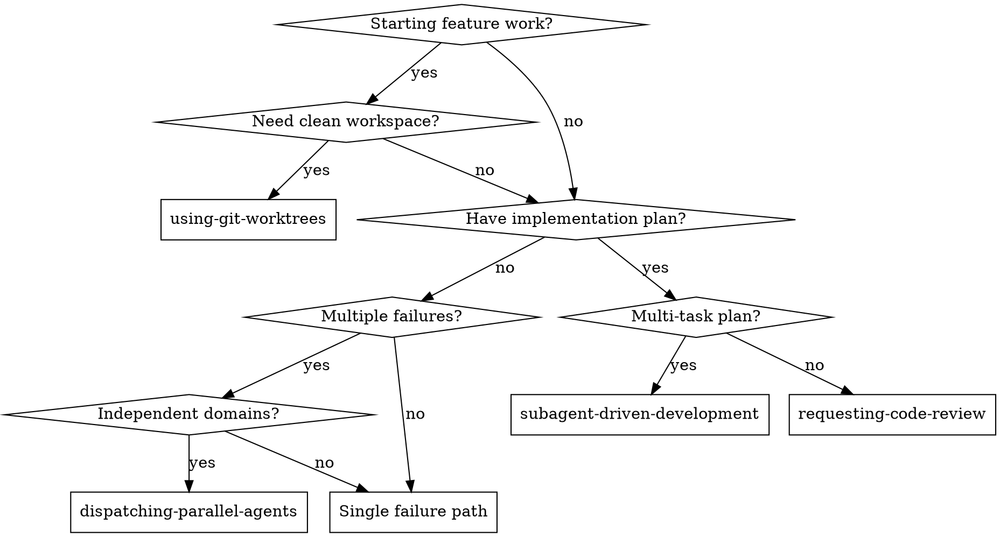

# Agentic Coding

A modular skill family for agent-assisted software development workflows. Each skill addresses a distinct phase or pattern—install only what you need.

## Skill Family Members

| Skill                           | Purpose             | When to Use                                                 |
| ------------------------------- | ------------------- | ----------------------------------------------------------- |
| **using-git-worktrees**         | Workspace isolation | Starting feature work that needs clean branch environment   |
| **dispatching-parallel-agents** | Parallel debugging  | 2+ completely independent failures across different domains |
| **subagent-driven-development** | Structured workflow | Multi-task implementation with integrated two-stage review  |
| **requesting-code-review**      | Standalone review   | Ad-hoc reviews outside structured workflows                 |

## Common Patterns

### Full Feature Development

```
using-git-worktrees → subagent-driven-development
     ↓                        ↓
Create isolated          Execute plan with
feature branch           per-task subagents
                         + integrated review
```

### Parallel Bug Investigation

```
dispatching-parallel-agents
     ↓
Multiple subagents
investigate unrelated
failures simultaneously
```

### Quick Post-Task Review

```
requesting-code-review
     ↓
Lightweight review
after single task
or before merge
```

## Installation

Install individual skills based on your workflow:

```bash
# Need workspace isolation?
saddle-cli install agentic-coding/using-git-worktrees

# Need parallel debugging?
saddle-cli install agentic-coding/dispatching-parallel-agents

# Need structured development workflow?
saddle-cli install agentic-coding/subagent-driven-development

# Need standalone code review?
saddle-cli install agentic-coding/requesting-code-review
```

## Relationship to Other Skills

- **coding-discipline**: Apply behavioral discipline within any agentic workflow
- **python-ultimate**: Technical standards for Python implementation
- **output-quality**: Review final output for anti-patterns

## Decision Flowchart


