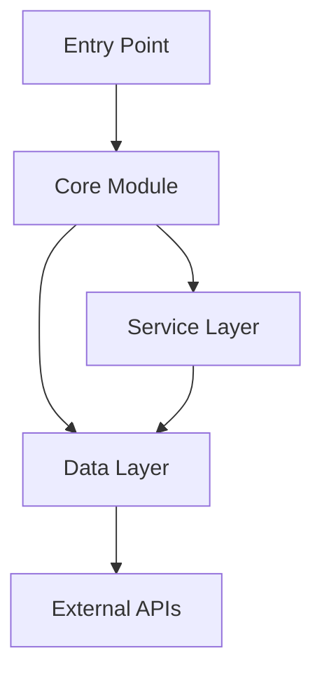
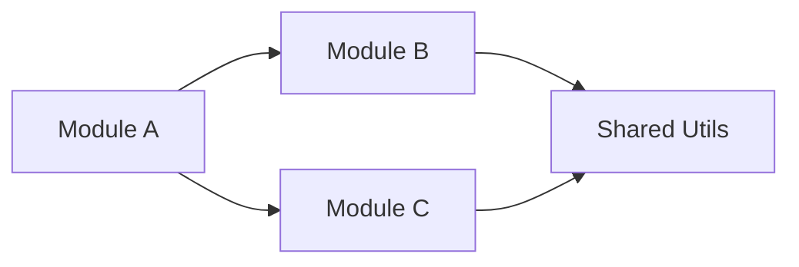
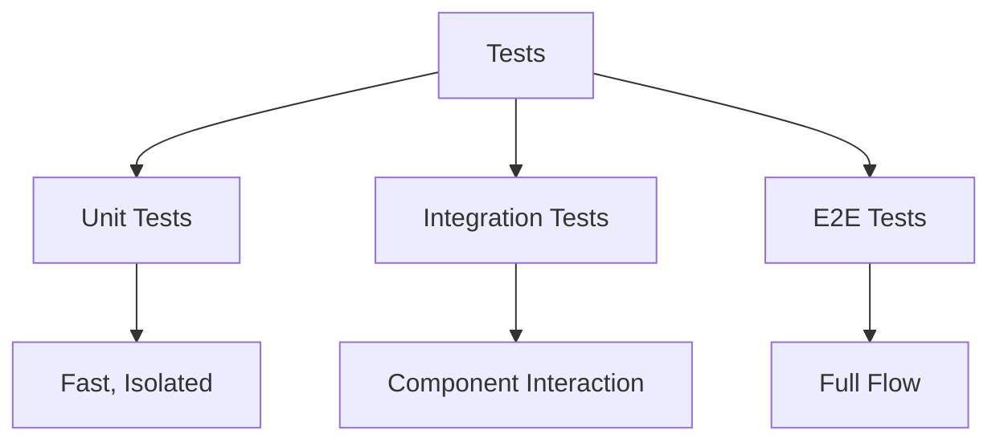
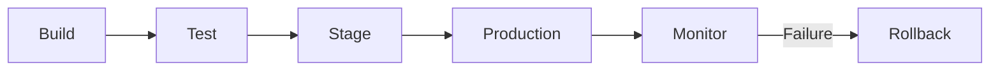

# Documentation Reference

Comprehensive guide for creating codebase documentation.

## Table of Contents

01. [Project Overview](#1-project-overview)
02. [Architecture](#2-architecture)
03. [Key Components](#3-key-components)
04. [Data Flow](#4-data-flow)
05. [API Reference](#5-api-reference)
06. [Configuration](#6-configuration)
07. [Setup Guide](#7-setup-guide)
08. [Development Guide](#8-development-guide)
09. [Testing](#9-testing)
10. [Deployment](#10-deployment)

______________________________________________________________________

## Documentation Workflow

Follow this process to document a codebase:

1. **Explore** — Launch Explore agent for thorough codebase investigation
2. **Map** — Use Glob to map directory structure and entry points
3. **Read** — Analyze README, entry points, core modules, configuration
4. **Synthesize** — Merge findings into cohesive documentation

### Depth Levels

| Level | Time | Coverage |
|-------|------|----------|
| Quick | 15-30 min | High-level overview |
| Standard | 30-60 min | Comprehensive coverage |
| Deep | 60+ min | Exhaustive with examples |

______________________________________________________________________

## 1. Project Overview

**Purpose**: Explain what the project does and why it exists.

Include:

- Purpose & vision
- Target users
- Key features
- Technology stack
- Project status

______________________________________________________________________

## 2. Architecture

**Purpose**: Explain how components interact at a high level.

Include:

- High-level structure
- Design patterns
- Control flow
- Architectural decisions

### Architecture Diagram



### Component Relationships



______________________________________________________________________

## 3. Key Components

**Purpose**: Document major modules, classes, and functions.

Include:

- Major modules and their responsibilities
- Classes & functions with purpose
- Interactions between components
- Extension points
- Code examples

### Component Template

````markdown
### Module: `<name>`

**Purpose**: What this module does

**Entry Points**:
- `function_name()` — description

**Key Classes**:
- `ClassName` — description

**Usage Example**:
```python
from module import function_name
result = function_name(arg1, arg2)
````

````

---

## 4. Data Flow

**Purpose**: Trace how data moves through the system.

### Data Flow Diagram

```mermaid
flowchart LR
    A[Input] --> B[Processing]
    B --> C[Transformation]
    C --> D[Storage]
    D --> E[Output]
````

### Sequence Diagram

```mermaid
sequenceDiagram
    participant Client
    participant API
    participant Service
    participant Database
    
    Client->>API: Request
    API->>Service: Process
    Service->>Database: Query
    Database-->>Service: Result
    Service-->>API: Response
    API-->>Client: Output
```

______________________________________________________________________

## 5. API Reference

**Purpose**: Document external and internal APIs.

Include:

- Endpoints with request/response formats
- Authentication requirements
- Error codes and handling
- Rate limits

### Endpoint Template

````markdown
### `POST /endpoint`

**Description**: What the endpoint does

**Request**:
```json
{
  "field": "type"
}
````

**Response**:

```json
{
  "result": "type"
}
```

````

---

## 6. Configuration

**Purpose**: Document all configuration options.

Include:
- Environment variables
- Config files and schemas
- Default values
- Required vs optional settings

### Configuration Table

| Variable | Type | Default | Description |
|----------|------|---------|-------------|
| `DEBUG` | bool | `false` | Enable debug mode |
| `API_KEY` | str | — | API authentication key |

---

## 7. Setup Guide

**Purpose**: Get new developers running locally.

Include:
- Prerequisites
- Installation steps
- Configuration
- Running the application
- Troubleshooting

### Quick Start

```bash
# Clone repository
git clone <repo-url>

# Install dependencies
uv sync

# Configure environment
cp .env.example .env

# Run application
uv run python src/main.py
````

______________________________________________________________________

## 8. Development Guide

**Purpose**: Standards for contributing code.

Include:

- Coding conventions
- Testing approach
- Error handling patterns
- Logging standards
- Security practices
- Performance guidelines

### Coding Standards

- Follow PEP 8 style guidelines
- Use type hints for all function signatures
- Write docstrings for public APIs
- Keep functions focused (single responsibility)

### Error Handling

```python
try:
    result = risky_operation()
except SpecificError as e:
    logger.error(f"Failed: {e}")
    raise CustomError("Meaningful message") from e
```

______________________________________________________________________

## 9. Testing

**Purpose**: Document testing requirements and patterns.

Include:

- Test categories (unit, integration, e2e)
- Running tests
- Writing new tests
- Coverage requirements
- Mocking patterns

### Test Structure



### Running Tests

```bash
# Run all tests
uv run pytest

# Run with coverage
uv run pytest --cov=src --cov-report=html

# Run specific category
uv run pytest tests/unit/
```

______________________________________________________________________

## 10. Deployment

**Purpose**: Document deployment process.

Include:

- Build process
- Deployment steps
- Environments (dev, staging, prod)
- Monitoring setup
- Rollback procedures

### Deployment Flow



______________________________________________________________________

## When to Document

Use this skill when you hear:

- "explain this codebase"
- "document the architecture"
- "how does this code work"
- "create developer documentation"
- "generate codebase overview"
- "create onboarding docs"

______________________________________________________________________

## Output Structure

Create documentation as:

```
docs/
├── README.md              # Overview and quick start
├── ARCHITECTURE.md        # System architecture
├── DEVELOPMENT.md         # Development guide
├── API.md                 # API documentation
├── DEPLOYMENT.md          # Deployment guide
└── CONTRIBUTING.md        # Contribution guidelines
```

Or a single comprehensive document if preferred.

______________________________________________________________________

## Visual Elements

Include these for clarity:

- **Mermaid diagrams** — Architecture, flow charts, sequence diagrams
- **Code examples** — From actual codebase
- **File references** — Specific file:line citations
- **Tables** — Structured information
- **Lists** — Guidelines and requirements

______________________________________________________________________

## Success Criteria

Good documentation includes:

- [ ] Complete coverage of all 10 sections
- [ ] Clear explanations with examples
- [ ] Visual diagrams for complex concepts
- [ ] Specific file:line references
- [ ] Actionable setup/development instructions
- [ ] New developer can onboard using only docs
- [ ] Organized, navigable structure
- [ ] Accurate and current information
